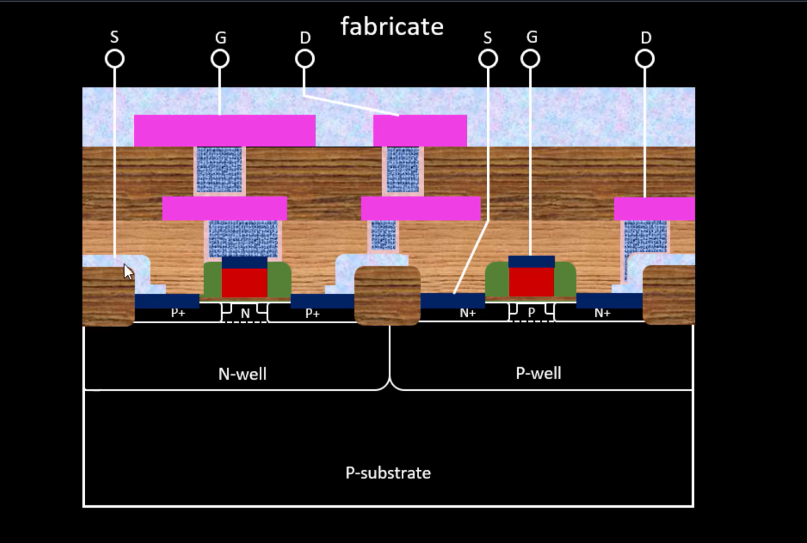
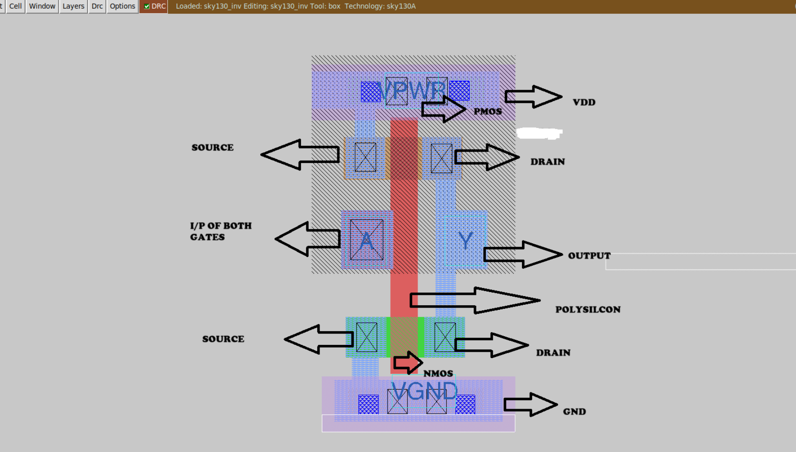
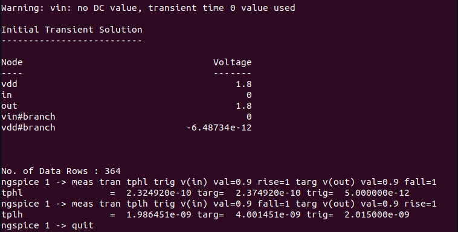
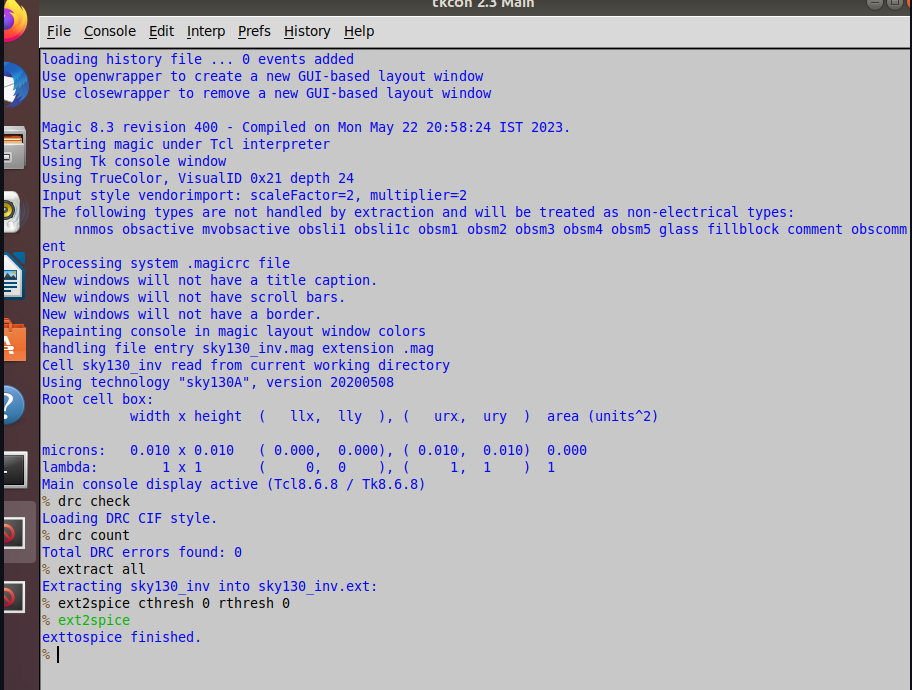
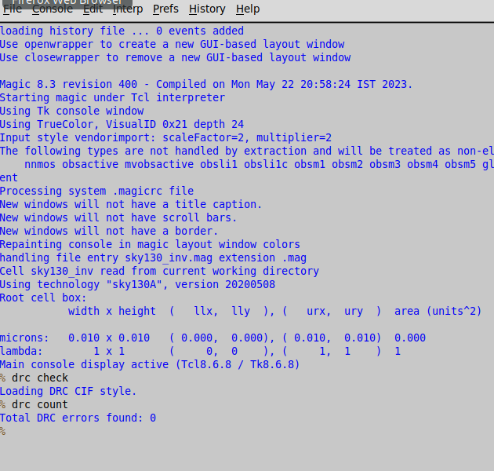
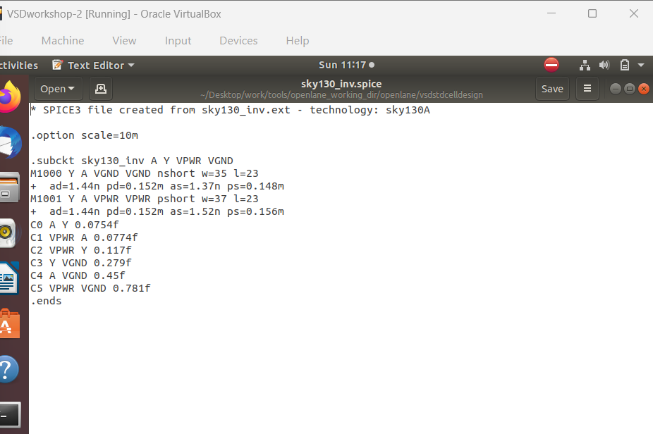
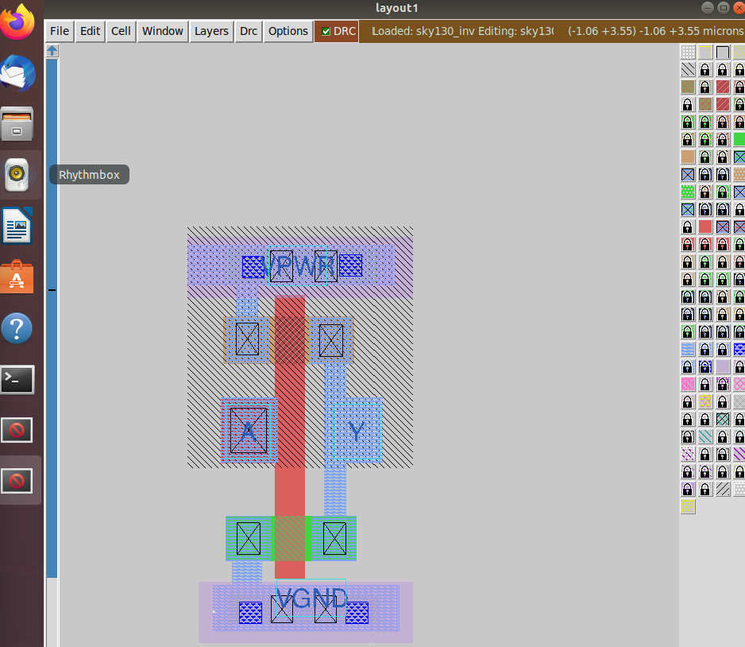

# Module 3 — CMOS Inverter: Fabrication, Simulation and Physical Design

> **Module Focus:** CMOS fabrication, transistor formation, SPICE simulation, physical layout, DRC and LVS verification.

---

## 📚 Contents

1. [Module Overview](#1-module-overview)
2. [CMOS Inverter Fundamentals](#2-cmos-inverter-fundamentals)
3. [CMOS Device Construction](#3-cmos-device-construction)
4. [Substrate and Well Formation](#4-substrate-and-well-formation)
5. [Active Area and Isolation](#5-active-area-and-isolation)
6. [Gate Formation](#6-gate-formation)
7. [Source and Drain Formation](#7-source-and-drain-formation)
8. [LDD and Spacer Engineering](#8-ldd-and-spacer-engineering)
9. [Contacts and Silicide](#9-contacts-and-silicide)
10. [Metal Routing](#10-metal-routing)
11. [CMOS Inverter Operation](#11-cmos-inverter-operation)
12. [Switching Point and Voltage Transfer](#12-switching-point-and-voltage-transfer)
13. [SPICE Modeling and DC Analysis](#13-spice-modeling-and-dc-analysis)
14. [Physical Layout and Pre-Layout Checks](#14-physical-layout-and-pre-layout-checks)
15. [DRC and LVS](#15-drc-and-lvs)
16. [Project Screenshots](#16-project-screenshots)
17. [Complete CMOS Design Flow](#17-complete-cmos-design-flow)
18. [Key Observations](#18-key-observations)
19. [Tools Used](#19-tools-used)
20. [Conclusion](#20-conclusion)

---

# 1. 🔷 Module Overview

A CMOS inverter is one of the fundamental circuits used in digital VLSI design. It provides a simple way to understand how PMOS and NMOS transistors work together to implement digital logic.

This module follows the CMOS inverter from semiconductor fabrication to electrical simulation and finally to physical layout and verification.

The major stages covered are:

* CMOS device fabrication
* PMOS and NMOS formation
* CMOS inverter operation
* SPICE simulation
* DC transfer analysis
* Physical layout using Magic
* Design Rule Check
* Layout Versus Schematic verification

### Overall Learning Flow

```text
CMOS Fabrication
       ↓
Transistor Formation
       ↓
CMOS Inverter
       ↓
SPICE Simulation
       ↓
Electrical Analysis
       ↓
Physical Layout
       ↓
DRC
       ↓
LVS
       ↓
Verified CMOS Design
```



# 2. 🔲 CMOS Inverter Fundamentals

A CMOS inverter is a digital logic circuit that produces the complement of its input.

It consists of two MOS transistors:

* **PMOS transistor** — provides the pull-up path.
* **NMOS transistor** — provides the pull-down path.

The gates of both devices are connected to the same input. Their drains are joined together to produce the output.

### Basic Circuit

```text
                 VDD
                  |
                ┌─────┐
        VIN ────┤ PMOS│
                └──┬──┘
                   |
                   +────── VOUT
                   |
                ┌──┴──┐
        VIN ────┤ NMOS│
                └─────┘
                   |
                  GND
```

### Truth Table

| Input | PMOS | NMOS | Output |
| ----- | ---- | ---- | ------ |
| LOW   | ON   | OFF  | HIGH   |
| HIGH  | OFF  | ON   | LOW    |

Therefore:

```text
VOUT = NOT(VIN)
```

The complementary action of PMOS and NMOS provides the required inversion.



# 3. 🧱 CMOS Device Construction

CMOS technology combines PMOS and NMOS transistors within the same integrated circuit.

For the process considered in this module:

| Device | Body Region          | Source / Drain |
| ------ | -------------------- | -------------- |
| PMOS   | N-Well               | P+             |
| NMOS   | P-Substrate / P-Well | N+             |

A MOS transistor is made from several physical regions, including:

* Substrate
* Well
* Active region
* Gate oxide
* Polysilicon
* Source
* Drain
* Contacts
* Metal layers

### Simplified Device Arrangement

```text
              PMOS                         NMOS

            P+     P+                    N+     N+
             |      |                     |      |
        ┌────┴──────┴────┐           ┌────┴──────┴────┐
        │     N-WELL     │           │  P-WELL /      │
        │                │           │  P-SUBSTRATE   │
        └────────────────┘           └────────────────┘

                    P-TYPE SUBSTRATE
```


---

# 4. 🟫 Substrate and Well Formation

## 4.1 P-Type Substrate

The fabrication process begins with a silicon wafer. For the process discussed here, a **P-type substrate** is used.

The substrate forms the base for the subsequent CMOS processing steps.

### Main Functions

The substrate supports:

* NMOS fabrication
* Well formation
* Isolation
* Device formation

```text
┌──────────────────────────────────┐
│                                  │
│          P-TYPE SILICON          │
│                                  │
│              WAFER               │
│                                  │
└──────────────────────────────────┘
```


---

## 4.2 N-Well Formation

PMOS requires an N-type body region. An N-Well is therefore formed inside the P-type substrate.

### Simplified Process

```text
P-Type Substrate
       ↓
Photoresist Pattern
       ↓
Photolithography
       ↓
N-Well Implantation
       ↓
Annealing
       ↓
N-Well Formation
```

The resulting N-Well provides the body region in which the PMOS device is fabricated.


---

# 5. 🟩 Active Area and Isolation

The **active area** is the part of the silicon where the transistor's source, channel and drain are created.

Isolation regions are used to electrically separate neighboring devices.

```text
       ISOLATION          ACTIVE AREA          ISOLATION

   ┌─────────────┐    ┌─────────────────┐    ┌─────────────┐
   │             │    │ SOURCE → CHANNEL│    │             │
   │             │    │          → DRAIN│    │             │
   └─────────────┘    └─────────────────┘    └─────────────┘
```

The transistor current path can be simplified as:

```text
SOURCE ───── CHANNEL ───── DRAIN
```

Proper isolation is important to prevent unwanted electrical interaction between adjacent devices.


# 6. ⚡ Gate Formation

The gate is the control element of a MOS transistor.

A thin gate oxide is formed above the active silicon. Polysilicon is then deposited and patterned to create the gate electrode.

### MOS Gate Structure

```text
                 POLYSILICON
                     │
                ┌─────────┐
                │  GATE   │
                └─────────┘
────────────────────────────────
                GATE OXIDE
────────────────────────────────
       SOURCE     CHANNEL     DRAIN
          │          │           │
        N+/P+                   N+/P+
────────────────────────────────
                 SILICON
```

Applying voltage to the gate controls whether a conducting channel develops between source and drain.

### Important Parameters

| Parameter | Meaning              |
| --------- | -------------------- |
| W         | Transistor width     |
| L         | Channel length       |
| tox       | Gate oxide thickness |
| VTH       | Threshold voltage    |


---

# 7. 🔵 Source and Drain Formation

Source and drain regions are created by selective doping of the semiconductor.

## NMOS Formation

NMOS uses **N+ source and drain** regions in a P-type body.

```text
       N+ SOURCE                    N+ DRAIN
           │                            │
           ▼                            ▼

      ┌──────────┐                ┌──────────┐
──────┴──────────┴────────────────┴──────────┴──────
                    NMOS CHANNEL
──────────────────────────────────────────────────────
                    P-TYPE REGION
```

## PMOS Formation

PMOS uses **P+ source and drain** regions inside the N-Well.

```text
       P+ SOURCE                    P+ DRAIN
           │                            │
           ▼                            ▼

      ┌──────────┐                ┌──────────┐
──────┴──────────┴────────────────┴──────────┴──────
                    PMOS CHANNEL
──────────────────────────────────────────────────────
                       N-WELL
```

The source and drain provide the terminals through which current flows through the transistor.


# 8. 🟨 LDD and Spacer Engineering

**LDD** stands for **Lightly Doped Drain**.

LDD extensions are placed near the transistor channel before the heavier source/drain implantation.

Their main purpose is to reduce the electric field near the drain and improve transistor reliability.

### Simplified Sequence

```text
Gate Formation
      ↓
Light Implantation
      ↓
Spacer Formation
      ↓
Heavy Source / Drain Implantation
```

```text
STEP 1 — Gate

             POLY
              │
──────────────┼──────────────


STEP 2 — Light Implant

          N-       N-
──────────┐         ┌──────────
          │   POLY  │
──────────┴─────────┴──────────


STEP 3 — Spacer

          ││
──────────┤POLY├──────────


STEP 4 — Heavy Implant

         N+       N+
─────────┐         ┌─────────
         │         │
─────────┴─────────┴─────────
```

### Benefits

* Reduces drain electric-field strength.
* Helps control hot-carrier effects.
* Improves device reliability.
* Supports stable transistor operation.


---

# 9. 🔗 Contacts and Silicide

## 9.1 Contact Formation

Contacts provide the connection between transistor regions and the metal routing layers.

```text
             METAL
────────────────────────
               │
             CONTACT
               │
────────────────────────
          DIFFUSION / POLY
```

Contacts can be made to:

* Source
* Drain
* Polysilicon
* Well
* Substrate

Correct contact placement is necessary to maintain the intended circuit connectivity.


## 9.2 Silicidation

Silicidation is used to lower the resistance of selected silicon and polysilicon regions.

### Process Sequence

```text
Metal Deposition
      ↓
Thermal Treatment
      ↓
Metal-Silicon Reaction
      ↓
Silicide Formation
      ↓
Removal of Unreacted Metal
      ↓
Low-Resistance Region
```

Silicide is commonly used to reduce resistance in:

* Source
* Drain
* Polysilicon gate


# 10. 🛣️ Metal Routing

After device formation, metal layers are used to connect the different transistor terminals and circuit nodes.

### Simplified Interconnect Stack

```text
                 METAL 2
────────────────────────────────
                    │
                   VIA
                    │
────────────────────────────────
                 METAL 1
────────────────────────────────
                    │
                 CONTACT
                    │
────────────────────────────────
              DIFFUSION / POLY
```

### Main Interconnect Elements

| Element      | Function                        |
| ------------ | ------------------------------- |
| Contact      | Connects device to metal        |
| Metal 1      | Local routing                   |
| Via          | Connects different metal levels |
| Metal 2      | Higher-level routing            |
| Upper metals | Long-distance and power routing |



# 11. 🔄 CMOS Inverter Operation

The inverter produces the opposite logic level at its output because PMOS and NMOS switch complementarily.

## 11.1 LOW Input

For:

```text
VIN = 0
```

the PMOS turns ON and the NMOS turns OFF.

```text
VIN = LOW
     ↓
PMOS ON
NMOS OFF
     ↓
VOUT ≈ VDD
```

Therefore:

```text
0 → 1
```


## 11.2 HIGH Input

For:

```text
VIN = VDD
```

the PMOS turns OFF and the NMOS turns ON.

```text
VIN = HIGH
     ↓
PMOS OFF
NMOS ON
     ↓
VOUT ≈ 0
```

Therefore:

```text
1 → 0
```


### Logic Summary

| Input | PMOS | NMOS | Output |
| ----- | ---- | ---- | ------ |
| LOW   | ON   | OFF  | HIGH   |
| HIGH  | OFF  | ON   | LOW    |

---

# 12. 📈 Switching Point and Voltage Transfer

The **switching threshold voltage**, represented by `VM`, indicates the region where the inverter changes its output state.

At the switching point:

```text
VIN = VOUT = VM
```

The PMOS and NMOS currents have equal magnitude:

```text
IDP = -IDN
```

### Voltage Transfer Characteristic

```text
VOUT
 │
 │───────────────
 │               \
 │                \
 │                 \
 │                  ─────────
 │
 └──────────────────────────── VIN
                    │
                   VM
```

The switching point is important when studying:

* Logic transitions
* Noise margins
* Voltage levels
* Inverter performance



# 13. 🧪 SPICE Modeling and DC Analysis

SPICE provides a way to evaluate the electrical behavior of the inverter before physical implementation.

It can be used to study the operating point, DC response and switching characteristics.

## 13.1 MOSFET Syntax

The general MOSFET format is:

```text
Mname Drain Gate Source Bulk Model W=... L=...
```

## 13.2 PMOS Definition

```text
M1 out in vdd vdd PMOS W=0.375u L=0.25u
```

| Terminal | Connection |
| -------- | ---------- |
| Drain    | out        |
| Gate     | in         |
| Source   | vdd        |
| Bulk     | vdd        |

## 13.3 NMOS Definition

```text
M2 out in 0 0 NMOS W=0.375u L=0.25u
```

| Terminal | Connection |
| -------- | ---------- |
| Drain    | out        |
| Gate     | in         |
| Source   | GND        |
| Bulk     | GND        |

---

## 13.4 Output Load

A capacitive load can be connected at the output:

```text
Cload out 0 10f
```

Thus:

```text
CLOAD = 10 fF
```

---

## 13.5 Supply Voltage

The supply can be defined as:

```text
Vdd vdd 0 2.5
```

Therefore:

```text
VDD = 2.5 V
```

---

## 13.6 Input Source

The input source is represented by:

```text
Vin in 0 2.5
```

---

## 13.7 Operating Point

The `.op` command calculates the DC operating condition of the circuit.

```text
.op
```

---

## 13.8 DC Sweep

The inverter transfer curve can be obtained using:

```text
.dc Vin 0 2.5 0.05
```

| Parameter |  Value |
| --------- | -----: |
| Start     |    0 V |
| Stop      |  2.5 V |
| Step      | 0.05 V |



## 13.9 Technology Model

A technology model can be included with:

```text
.include tsmc_025um_model.mod
```

The actual model filename depends on the technology and PDK being used.

---

## 13.10 Complete SPICE Example

```spice
* CMOS Inverter DC Analysis

M1 out in vdd vdd PMOS W=0.375u L=0.25u
M2 out in 0   0   NMOS W=0.375u L=0.25u

Cload out 0 10f

Vdd vdd 0 2.5
Vin in  0 2.5

.op
.dc Vin 0 2.5 0.05

.include tsmc_025um_model.mod

.end
```


# 14. 🖥️ Physical Layout and Pre-Layout Analysis

Before creating the final layout, the inverter should be evaluated at the circuit level.

### Parameters to Examine

* DC transfer curve
* Switching threshold
* HIGH and LOW output levels
* Current
* Power
* Load capacitance
* Delay-related behavior

### Pre-Layout Sequence

```text
Schematic
    ↓
SPICE Simulation
    ↓
DC Analysis
    ↓
Switching Threshold
    ↓
Pre-Layout Evaluation
    ↓
Physical Layout
```


## Magic Layout

Magic is a VLSI layout editor that can be used to construct and inspect physical chip geometry.

Launch Magic using:

```bash
magic -d OGL
```

Magic provides facilities for:

* Creating layout geometry
* Editing technology layers
* Connecting device regions
* Inspecting physical structures
* Performing DRC
* Extracting circuit information
* Supporting LVS


# 15. 🔍 DRC and LVS Verification

After the physical layout has been created, it must be checked before considering the design complete.

## 15.1 DRC — Design Rule Check

DRC determines whether the layout satisfies the physical manufacturing constraints of the selected technology.

Typical checks include:

* Minimum layer width
* Minimum spacing
* Contact dimensions
* Layer overlap
* Enclosure rules

### DRC Flow

```text
Physical Layout
      ↓
     DRC
      ↓
PASS / ERRORS
```


## 15.2 LVS — Layout Versus Schematic

LVS checks whether the circuit represented by the physical layout matches the original schematic.

```text
SCHEMATIC              PHYSICAL LAYOUT
     │                       │
     └──────────┬────────────┘
                ↓
               LVS
                ↓
          MATCH / MISMATCH
```

A successful LVS result confirms that the physical layout preserves the intended circuit connectivity.


---

# 16. 🖼️ Project Screenshots

This section contains the actual results obtained during the implementation.

## 16.1 CMOS Fabrication

Add the fabrication image here.


## 16.2 CMOS Inverter Layout

Add the final Magic layout here.


# 17. 🔁 Complete CMOS Design Flow

The complete process studied in this module can be summarized as:

```text
             CMOS FABRICATION
                    ↓
                 SUBSTRATE
                    ↓
              WELL FORMATION
                    ↓
                ACTIVE AREA
                    ↓
                 GATE OXIDE
                    ↓
              POLYSILICON GATE
                    ↓
             SOURCE / DRAIN
                    ↓
                LDD / SPACER
                    ↓
                SILICIDATION
                    ↓
             CONTACT FORMATION
                    ↓
            METAL INTERCONNECTION
                    ↓
               SPICE ANALYSIS
                    ↓
             PRE-LAYOUT CHECK
                    ↓
                MAGIC LAYOUT
                    ↓
                    DRC
                    ↓
                    LVS
                    ↓
             VERIFIED CMOS DESIGN
```


# 18. 📌 Key Observations

| Topic          | Key Observation                          |
| -------------- | ---------------------------------------- |
| CMOS           | Combines PMOS and NMOS devices           |
| PMOS           | Fabricated inside the N-Well             |
| NMOS           | Formed in the P-type region              |
| Gate           | Controls channel formation               |
| Source / Drain | Provide current-carrying terminals       |
| LDD            | Helps reduce drain electric-field stress |
| Silicide       | Reduces selected series resistance       |
| Contact        | Connects device regions to metal         |
| Metal          | Provides circuit interconnection         |
| SPICE          | Used for electrical simulation           |
| `.op`          | Calculates operating point               |
| `.dc`          | Performs DC sweep                        |
| VM             | Represents switching threshold           |
| Magic          | Used for physical layout                 |
| DRC            | Checks physical design rules             |
| LVS            | Compares layout with schematic           |

---

# 19. 🛠️ Tools Used

| Tool / Technology | Application                   |
| ----------------- | ----------------------------- |
| **SPICE**         | Circuit-level simulation      |
| **Magic**         | Physical layout design        |
| **CMOS PDK**      | Technology/device information |
| **Linux**         | VLSI design environment       |
| **Git**           | Version control               |
| **GitHub**        | Repository management         |

---

# 20. 🚀 Conclusion

This module demonstrates the complete development cycle of a CMOS inverter, beginning with semiconductor processing and ending with physical verification.

The fabrication section explains how the substrate, well, active region, gate, source/drain, contacts and interconnects contribute to the final transistor structure.

The circuit-level stage uses SPICE to examine the inverter's electrical response, including its DC transfer characteristic and switching threshold.

The physical-design stage converts the circuit into geometric layout using Magic. Finally, DRC verifies compliance with manufacturing rules and LVS confirms that the layout represents the intended schematic.

### Final Learning Path

```text
FABRICATION
     ↓
DEVICE FORMATION
     ↓
CMOS INVERTER
     ↓
SPICE SIMULATION
     ↓
ELECTRICAL ANALYSIS
     ↓
PHYSICAL LAYOUT
     ↓
DRC
     ↓
LVS
     ↓
FINAL VERIFIED DESIGN
```

The concepts covered here provide a foundation for further work in:

* VLSI Design
* CMOS Digital Design
* Physical Design
* ASIC Design
* SPICE Simulation
* Standard Cell Development
* Layout Design

---

# 🖼️ Image Placement Guide

| No. | Section             | Image to Add                      |
| --: | ------------------- | --------------------------------- |
|   1 | Module Overview     | CMOS fabrication image            |
|   2 | CMOS Inverter       | Inverter schematic                |
|   3 | Device Construction | PMOS/NMOS cross-section           |
|   4 | Substrate           | P-type substrate image            |
|   5 | N-Well              | N-Well formation diagram          |
|   6 | Active Area         | Active/isolation diagram          |
|   7 | Gate Formation      | MOS gate structure                |
|   8 | Source/Drain        | NMOS/PMOS doping image            |
|   9 | LDD                 | LDD/spacer diagram                |
|  10 | Contacts            | Contact structure                 |
|  11 | Silicide            | Silicidation diagram              |
|  12 | Metal Routing       | Metal/via structure               |
|  13 | LOW Input           | PMOS ON screenshot                |
|  14 | HIGH Input          | NMOS ON screenshot                |
|  15 | Switching Point     | VTC graph                         |
|  16 | SPICE Setup         | SPICE/netlist screenshot          |
|  17 | SPICE Result        | DC sweep graph                    |
|  18 | Pre-Layout          | Pre-layout result                 |
|  19 | Magic               | Magic layout screenshot           |
|  20 | DRC                 | DRC PASS screenshot               |
|  21 | LVS                 | LVS MATCH screenshot              |
|  22 | Project Screenshots | `images/FABRICATION_CMOS.png`     |
|  23 | Project Screenshots | `images/LAYOUT_CMOS_INVERTER.png` |
|  24 | Design Flow         | Overall flowchart                 |

---

# 📁 Recommended Folder Structure

```text
MODULE-3/
│
├── README.md
├── FABRICATION_CMOS.png
│
└── images/
    ├── FABRICATION_CMOS.png
    ├── LAYOUT_CMOS_INVERTER.png
    ├── CMOS_INVERTER_SCHEMATIC.png
    ├── SPICE_SETUP.png
    ├── SPICE_VTC.png
    ├── DRC_RESULT.png
    └── LVS_RESULT.png
```

### GitHub Image Syntax

For an image in the same folder:

```markdown

```

For an image inside `images/`:

```markdown

```

For a caption:

```markdown


**Figure: CMOS Inverter Layout using Magic**
```
