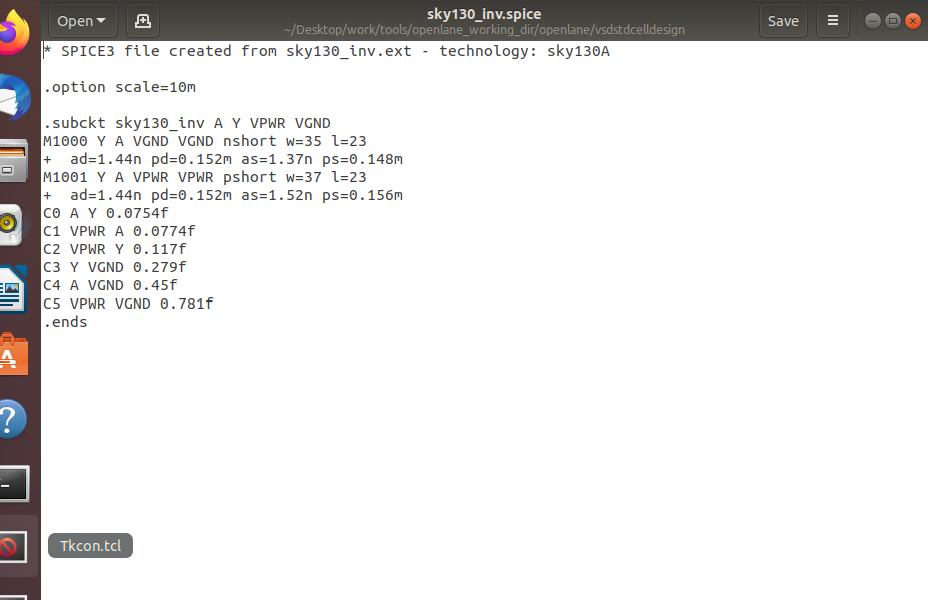
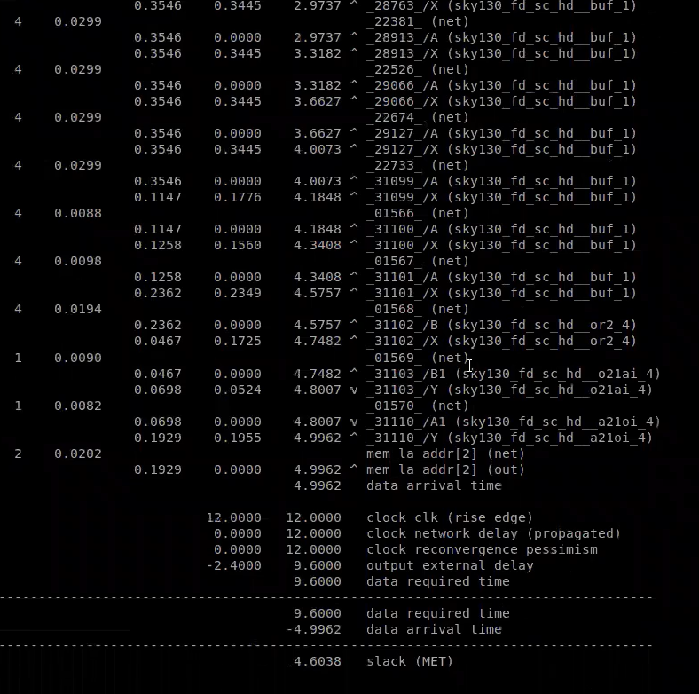
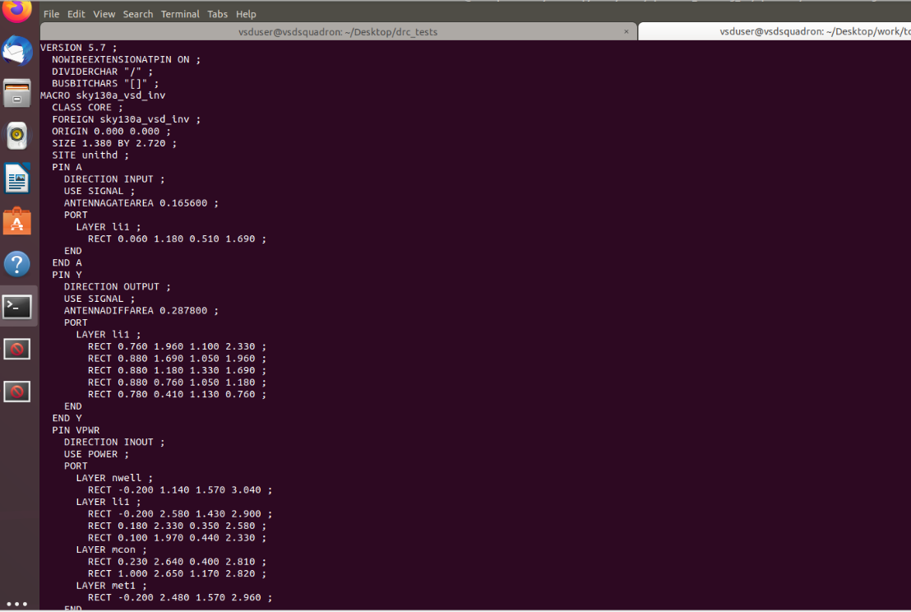

# MODULE 4 – TIMING ANALYSIS & CLOCK TREE SYNTHESIS

### Timing Modeling • Delay Analysis • Setup/Hold Checks • Clock Tree Synthesis • Signal Integrity

---

## 1. INTRODUCTION

In digital VLSI design, it is not enough for a circuit to produce the correct logical output. The circuit must also produce that output within the required time.

As the design moves from RTL toward physical implementation, several physical effects begin to influence timing:

* Cell propagation delay
* Input transition time
* Output capacitance
* Interconnect delay
* Clock latency
* Clock skew
* Clock jitter
* Crosstalk
* Parasitic effects

Timing analysis is therefore used to determine whether signals reach their destinations within the required timing limits.

This module focuses on how timing is modeled, how setup and hold requirements are checked, how a clock tree is constructed, and how Static Timing Analysis (STA) is performed using tools such as OpenSTA and OpenROAD.



`RTL → Synthesis → Placement → CTS → Routing → STA`

**Suggested caption:**
**Figure 1: Overall timing analysis flow in a digital VLSI design**

---

# 2. TIMING MODELING

Timing modeling describes how a standard cell behaves from a timing perspective.

The delay of a cell is not a fixed value. It depends mainly on:

* Input transition or input slew
* Output load capacitance
* Cell characteristics
* Operating conditions
* Technology library information

A simplified relationship can be represented as:

$$
Delay = f(Input\ Slew,\ Output\ Load)
$$

This means that the same logic gate can have different delays depending on how quickly its input changes and how much capacitance it has to drive.

Timing libraries contain this information in the form of timing tables.

These tables are used by synthesis, placement, CTS and STA tools to estimate realistic circuit timing.


---

# 3. DELAY TABLES

Standard-cell timing libraries commonly represent delay using two-dimensional lookup tables.

The two major parameters are:

1. Input transition
2. Output capacitance

For different combinations of these parameters, the library provides corresponding delay values.

A simplified representation is:

| Input Slew |       Low Load |    Medium Load |        High Load |
| ---------- | -------------: | -------------: | ---------------: |
| Fast       |      Low Delay | Moderate Delay |     Higher Delay |
| Medium     | Moderate Delay |   Higher Delay |      Large Delay |
| Slow       |   Higher Delay |    Large Delay | Very Large Delay |

In general:

**Higher output load → larger delay**

and

**Slower input transition → larger delay**

Therefore, timing analysis must consider both the input transition and the load being driven by the cell.


---

# 4. INPUT SLEW AND OUTPUT LOAD

## 4.1 Input Slew

Input slew represents how quickly a signal changes from one logic level to another.

A fast transition has a smaller transition time, while a slow transition takes longer.

For example:

* Fast input transition → smaller slew
* Slow input transition → larger slew

Slow input transitions can increase cell delay and may also affect signal integrity.


---

## 4.2 Output Load

Output load represents the amount of capacitance that a cell output must drive.

The load can come from:

* Input capacitance of connected cells
* Interconnect capacitance
* Parasitic capacitance
* Fanout

As the load increases, the output transition generally becomes slower and the propagation delay increases.


---

## 4.3 Combined Effect

Input slew and output load work together to determine cell delay.

| Parameter   | Increase in Parameter | General Timing Effect |
| ----------- | --------------------- | --------------------- |
| Input Slew  | Increases             | Delay increases       |
| Output Load | Increases             | Delay increases       |
| Fanout      | Increases             | Delay increases       |

Therefore, realistic timing analysis cannot assume a single constant delay for every cell.

---

# 5. SETUP TIMING ANALYSIS

Setup timing ensures that data reaches the destination flip-flop early enough before the active clock edge.

A typical synchronous path contains:

**Launch Flip-Flop → Combinational Logic → Capture Flip-Flop**

The launch flip-flop sends data after the launching clock edge.

The data then travels through the combinational logic and must reach the capture flip-flop before its next active clock edge.


`Launch FF → Combinational Logic → Capture FF`


## 5.1 Basic Setup Condition

For an ideal clock:

$$
Data\ Delay < Clock\ Period - Setup\ Time
$$

This means that the data path must complete within the available timing window.

For real designs, clock uncertainty must also be considered.

The available timing margin can be represented as:

$$
Available\ Time =
Clock\ Period - Setup\ Time - Setup\ Uncertainty
$$

---

## 5.2 Setup Slack

Setup slack indicates whether the setup requirement is satisfied.

$$
Setup\ Slack = Required\ Time - Arrival\ Time
$$

Interpretation:

* **Positive slack → Setup requirement satisfied**
* **Zero slack → Exactly meets requirement**
* **Negative slack → Setup violation**

### Example

Consider:

* Clock Period = 1 ns
* Setup Time = 0.10 ns
* Setup Uncertainty = 0.05 ns

Then:

$$
Available\ Time = 1 - 0.10 - 0.05
$$

$$
Available\ Time = 0.85\ ns
$$

Therefore, the data path should complete within approximately 0.85 ns.


# 6. HOLD TIMING ANALYSIS

Hold analysis checks whether the data remains stable for the required amount of time immediately after the active clock edge.

Unlike setup analysis, hold analysis is mainly concerned with data arriving **too early**.

A simplified ideal condition is:

$$
Data\ Delay > Hold\ Time
$$

For a real clock network, clock path delays also influence the hold relationship.

The condition can be represented as:

$$
O + d_1 > H + d_2
$$

where:

* \(O\) = data path delay
* \(d_1\) = launch clock delay
* \(d_2\) = capture clock delay
* \(H\) = hold time requirement

---

## 6.1 Hold Slack

Hold slack can be expressed as:

$$
Hold\ Slack = Arrival\ Time - Required\ Time
$$

Interpretation:

* **Positive slack → Hold requirement satisfied**
* **Zero slack → Boundary condition**
* **Negative slack → Hold violation**

---

## 6.2 Setup vs Hold

| Setup Analysis                           | Hold Analysis                                    |
| ---------------------------------------- | ------------------------------------------------ |
| Checks data arriving too late            | Checks data arriving too early                   |
| Related mainly to next clock edge        | Related mainly to same active clock edge         |
| Clock period is important                | Clock period is generally not the primary factor |
| Negative slack indicates setup violation | Negative slack indicates hold violation          |



# 7. CLOCK JITTER AND UNCERTAINTY

A real clock signal does not always arrive at exactly the expected time.

Small variations in clock edge position are called **clock jitter**.

Clock uncertainty is used during timing analysis to account for effects such as:

* Clock jitter
* Process variation
* Modeling uncertainty
* Other timing variations

Clock uncertainty reduces the timing margin available for data propagation.

For setup analysis, greater uncertainty reduces the available time.


---

# 8. CLOCK TREE SYNTHESIS

Clock Tree Synthesis (CTS) is the process of creating a physical clock distribution network from the clock source to the sequential elements in a design.

A clock may need to drive hundreds or thousands of flip-flops.

Directly connecting one clock source to all these loads can result in:

* High capacitance
* Large transition time
* Unequal clock arrival
* Excessive delay
* Poor signal integrity

CTS addresses these problems by constructing a balanced clock network.

A typical clock tree contains:

**Clock Source → Clock Buffers → Branches → Flip-Flops**


## 8.1 Main Objectives of CTS

CTS attempts to:

* Reduce clock skew
* Control clock latency
* Improve clock transition
* Handle high fanout
* Drive clock loads effectively
* Balance clock paths
* Improve signal integrity
* Maintain timing requirements

In the OpenLane/OpenROAD flow, **TritonCTS** is used for clock tree synthesis.

A typical OpenLane command is:

```bash
run_cts
```


# 9. CLOCK SKEW AND CLOCK LATENCY

## 9.1 Clock Skew

Clock skew represents the difference between the arrival times of the clock signal at two sequential elements.

$$
Clock\ Skew =
Clock\ Arrival\ Time_1 -
Clock\ Arrival\ Time_2
$$

Ideally, clock signals should reach the sequential elements at nearly the same time.

Large skew can affect both setup and hold timing.


## 9.2 Clock Latency

Clock latency is the time required for the clock signal to travel from its source to the destination element.

Clock latency is influenced by:

* Clock buffers
* Interconnect length
* Wire resistance
* Wire capacitance
* RC effects
* Clock network structure

Therefore, after CTS, the clock is no longer treated as an ideal signal.

---

# 10. CROSSTALK AND SIGNAL INTEGRITY

When two wires are routed close to each other, electrical coupling can occur between them.

This interaction is commonly referred to as **crosstalk**.

One signal is called the:

**Aggressor**

and the affected signal is called the:

**Victim**

Coupling capacitance between the wires can introduce unwanted effects such as:

* Noise
* Glitches
* Delay variation
* Timing uncertainty
* Clock disturbances

This is particularly important for clock signals because clock integrity directly affects sequential timing.


# 11. CLOCK SHIELDING

Clock signals are sensitive to noise and coupling.

One technique used to protect important clock wires is **clock shielding**.

Shield wires are placed next to the clock route and connected to a stable reference such as:

* VDD
* GND

The shield reduces unwanted capacitive coupling between the clock and nearby signal wires.

Benefits include:

* Reduced crosstalk
* Lower noise
* Improved clock integrity
* More stable timing
* Reduced unwanted coupling


# 12. IDEAL CLOCK VS REAL CLOCK

Before CTS, timing analysis commonly uses an **ideal clock**.

An ideal clock assumes that the clock reaches the required sequential elements without considering the actual physical clock network.

After CTS, the clock becomes a **propagated or real clock**.

The real clock includes physical effects such as:

* Clock buffer delays
* Wire delays
* Clock latency
* Clock skew
* RC parasitics


## 12.1 Comparison

| Ideal Clock                        | Real Clock                           |
| ---------------------------------- | ------------------------------------ |
| Used mainly before CTS             | Used after CTS                       |
| No physical clock network          | Includes physical clock network      |
| Clock arrival is assumed           | Clock arrival is calculated          |
| Skew is not physically represented | Clock skew is included               |
| Clock latency is simplified        | Clock latency is included            |
| Limited physical effects           | Includes RC and interconnect effects |

The transition from ideal clock analysis to propagated clock analysis is an important step toward realistic timing closure.

---

# 13. STATIC TIMING ANALYSIS USING OPENSTA

Static Timing Analysis (STA) evaluates timing paths without requiring functional input vectors.

Instead of simulating every possible input combination, STA mathematically analyzes timing relationships throughout the design.

OpenSTA can be used to determine:

* Data arrival time
* Required arrival time
* Setup slack
* Hold slack
* Clock skew
* Critical timing paths
* Timing violations

The fundamental slack relationship is:

$$
Slack = Required\ Time - Arrival\ Time
$$

For a valid timing path:

$$
Slack \geq 0
$$

A negative slack value indicates a timing violation.


# 14. TIMING AFTER CLOCK TREE SYNTHESIS

After CTS, the clock network contains actual physical elements.

Therefore, timing analysis can account for:

* Clock buffer delay
* Clock wire delay
* Clock skew
* Clock latency
* Parasitic effects

This provides a more realistic representation of the timing behavior of the physical design.

A typical flow is:

```text
Synthesis
   ↓
Floorplanning
   ↓
Placement
   ↓
Clock Tree Synthesis
   ↓
Propagated Clock
   ↓
Static Timing Analysis
   ↓
Setup/Hold Verification
```

---

# 15. WNS AND TNS

Two important timing-quality indicators are:

* WNS – Worst Negative Slack
* TNS – Total Negative Slack

---

## 15.1 Worst Negative Slack

WNS represents the worst slack value among the analyzed timing paths.

For example, if the timing paths have:

```text
+0.20 ns
-0.05 ns
-0.15 ns
```

then:

$$
WNS = -0.15\ ns
$$

because -0.15 ns is the smallest slack value.

A non-negative WNS indicates that the analyzed paths do not have negative slack.

---

## 15.2 Total Negative Slack

TNS represents the sum of negative slack values.

For example:

```text
-0.05 ns
-0.10 ns
-0.15 ns
```

Then:

$$
TNS = -0.05 - 0.10 - 0.15
$$

$$
TNS = -0.30\ ns
$$

Therefore, TNS gives an indication of the total amount of timing violation across the analyzed paths.


# 16. IMPORTANT OPENLANE AND OPENROAD COMMANDS

The following commands are useful for carrying out the physical-design timing flow.

## 16.1 Synthesis

```bash
run_synthesis
```

This performs RTL synthesis and generates the synthesized netlist.

---

## 16.2 Floorplanning

```bash
run_floorplan
```

This creates the initial physical organization of the design.

---

## 16.3 Placement

```bash
run_placement
```

This places standard cells inside the design area.

---

## 16.4 Clock Tree Synthesis

```bash
run_cts
```

This generates the clock distribution network.


## 16.5 Checking Synthesis Strategy

```bash
echo $::env(SYNTH_STRATEGY)
```

This can be used to display the synthesis strategy configured in the environment.

---

## 16.6 Enabling Synthesis Buffering

```bash
set ::env(SYNTH_BUFFERING) 1
```

This enables synthesis buffering.

---

## 16.7 Enabling Synthesis Sizing

```bash
set ::env(SYNTH_SIZING) 1
```

This enables synthesis sizing.

---

## 16.8 Starting OpenROAD

```bash
openroad
```

This launches the OpenROAD environment for physical-design analysis and processing.

---

## 16.9 Reporting Timing Paths

```tcl
report_checks -path_delay min_max -format full_clock_expanded -digits 4
```

This command provides detailed timing information for minimum and maximum delay paths.

The report can contain values such as:

* Arrival Time
* Required Time
* Slack
* Data Delay
* Clock Delay
* Clock Skew


## 16.10 Setup Clock Skew Report

```tcl
report_clock_skew -setup
```

This reports clock skew related to setup analysis.

---

## 16.11 Hold Clock Skew Report

```tcl
report_clock_skew -hold
```

This reports clock skew related to hold analysis.


# 17. IMPORTANT TIMING REPORT PARAMETERS

During timing analysis, the following values are especially important:

| Parameter     | Meaning                                                  |
| ------------- | -------------------------------------------------------- |
| Arrival Time  | Time at which data reaches the endpoint                  |
| Required Time | Latest/earliest allowable arrival depending on the check |
| Slack         | Difference between required and actual arrival           |
| Data Delay    | Delay through the data path                              |
| Clock Delay   | Delay through the clock path                             |
| Clock Skew    | Difference between clock arrival times                   |
| WNS           | Worst slack value                                        |
| TNS           | Sum of negative slack values                             |

These values help identify the paths that require timing optimization.

---

# 18. COMPLETE TIMING AND CTS FLOW

The complete sequence studied in this module can be represented as:

```text
Timing Modeling
      ↓
Delay Tables
      ↓
Input Slew + Output Load
      ↓
Ideal Clock STA
      ↓
Placement
      ↓
Clock Tree Synthesis
      ↓
Clock Skew Analysis
      ↓
Crosstalk / Signal Integrity
      ↓
Real Clock STA
      ↓
Setup / Hold Analysis
      ↓
Timing Reports
      ↓
WNS / TNS
      ↓
Timing Closure
```


# 19. SETUP AND HOLD – QUICK REFERENCE

| Feature             | Setup                                            | Hold                             |
| ------------------- | ------------------------------------------------ | -------------------------------- |
| Main concern        | Data arriving late                               | Data arriving early              |
| Timing relationship | Before capture edge                              | After capture edge               |
| Slack expression    | Required − Arrival                               | Arrival − Required               |
| Negative slack      | Setup violation                                  | Hold violation                   |
| Major factors       | Data path, clock period, setup time, uncertainty | Data path, hold time, clock skew |


---

# 20. IDEAL CLOCK AND REAL CLOCK – QUICK REFERENCE

| Ideal Clock                       | Real Clock                      |
| --------------------------------- | ------------------------------- |
| Pre-CTS representation            | Post-CTS representation         |
| No physical clock network         | Physical clock network included |
| Simplified timing                 | Realistic timing                |
| Clock skew not physically modeled | Clock skew considered           |
| Clock latency simplified          | Clock latency included          |
| Limited parasitic effects         | Physical effects included       |

---

# 21. TOOLS USED

The major tools associated with this timing and CTS flow are:

### OpenLane

Used as the overall RTL-to-GDSII implementation flow.

### Yosys

Used for RTL synthesis.

### OpenROAD

Used for physical design stages such as floorplanning, placement and CTS.

### OpenSTA

Used for Static Timing Analysis.

### TritonCTS

Used for Clock Tree Synthesis.

### SKY130 PDK

Provides the technology-specific libraries and process information.

### Magic

Used for layout-related inspection and physical verification.

---

# 22. PRACTICAL TIMING REPORT

The OpenSTA timing analysis performed in this module produced the following result:

| Timing Parameter   |     Result |
| ------------------ | ---------: |
| Clock Period       | 12.0000 ns |
| Data Arrival Time  |  4.9962 ns |
| Data Required Time |  9.6000 ns |
| Slack              |  4.6038 ns |
| Timing Status      |        MET |

The calculated slack is:

$$
Slack = Required\ Time - Arrival\ Time
$$

$$
Slack = 9.6000 - 4.9962
$$

$$
Slack = 4.6038\ ns
$$

The resulting slack is positive, indicating that the analyzed timing requirement is satisfied for this reported path.


Immediately below the image, you can write:

> The OpenSTA timing report shows a clock period of 12.0000 ns, a data arrival time of 4.9962 ns, and a required time of 9.6000 ns. The resulting slack is 4.6038 ns, indicating that the reported timing requirement is met.

---

# 23. TIMING CLOSURE

Timing closure is the process of ensuring that all important timing constraints are satisfied before the design is finalized.

If timing violations are found, the design may require optimization.

Possible areas of optimization include:

* Cell sizing
* Buffer insertion
* Logic optimization
* Placement optimization
* Clock tree optimization
* Routing optimization
* Reducing excessive fanout
* Reducing interconnect delay

The objective is to achieve acceptable timing while also considering area, power and signal integrity.

---

# 24. KEY LEARNINGS FROM MODULE 4

The major concepts covered in this module are:

1. Cell delay depends on input slew and output load.
2. Timing libraries use delay tables to model standard-cell behavior.
3. Setup analysis checks whether data arrives early enough.
4. Hold analysis checks whether data remains stable long enough.
5. Clock jitter introduces uncertainty in clock arrival.
6. Clock Tree Synthesis creates the physical clock distribution network.
7. Clock skew represents differences in clock arrival time.
8. Clock latency represents the delay through the clock network.
9. Crosstalk can disturb signal timing and integrity.
10. Clock shielding helps reduce unwanted coupling.
11. Ideal clocks are used before physical clock implementation.
12. Real clocks include physical clock-network effects.
13. OpenSTA performs Static Timing Analysis.
14. WNS identifies the worst slack.
15. TNS represents the total negative slack.
16. Timing reports are used to identify timing problems.
17. Positive slack indicates that the analyzed timing requirement is satisfied.
18. CTS and STA are essential parts of physical-design timing closure.

---

# 25. OVERALL UNDERSTANDING

Timing analysis connects logical design with physical implementation.

At the beginning of the design flow, timing is represented using simplified cell models and ideal clocks.

As the design progresses through:

```text
Synthesis
   ↓
Floorplan
   ↓
Placement
   ↓
CTS
   ↓
Routing
   ↓
STA
```

the timing model becomes increasingly realistic.

The final timing behavior is influenced by:

$$
Cell\ Delay +
Wire\ Delay +
Clock\ Delay +
Clock\ Skew +
RC\ Effects +
Crosstalk
$$

Therefore, timing closure requires consideration of both logical and physical characteristics of the circuit.

---

# 26. CONCLUSION

This module provided a practical understanding of timing analysis and Clock Tree Synthesis in a VLSI physical-design flow.

The study began with timing modeling and delay tables, where the relationship between input slew, output load and cell delay was examined.

Setup and hold analysis were then used to understand the timing requirements of sequential circuits. Clock jitter and uncertainty were introduced to represent variations in real clock behavior.

The Clock Tree Synthesis stage demonstrated how a clock distribution network is created to manage fanout, latency, transition and skew. The concepts of clock skew and clock latency were then connected to physical clock implementation.

Signal-integrity topics such as crosstalk and clock shielding showed how neighboring interconnects can influence timing behavior.

Finally, OpenSTA and OpenROAD timing reports were used to examine real timing values such as arrival time, required time and slack. The reported result of **4.6038 ns positive slack** demonstrates that the analyzed timing requirement was satisfied.

Overall, this module establishes the connection between timing models, physical clock distribution, signal integrity and Static Timing Analysis, which together form an important part of achieving timing closure in modern digital VLSI design.

---


## IMPORTANT

Do **not** add random images just to increase the number of figures.

For screenshots from your actual work, prioritize:

1. `run_synthesis` output
2. `run_floorplan` output
3. `run_placement` output
4. `run_cts` output
5. OpenROAD timing report
6. `report_clock_skew -setup`
7. `report_clock_skew -hold`
8. OpenSTA final timing report
9. WNS/TNS result
10. Final physical-design/CTS visualization

These practical screenshots will make the module look like **your own hands-on work**, rather than a copied theoretical document.
