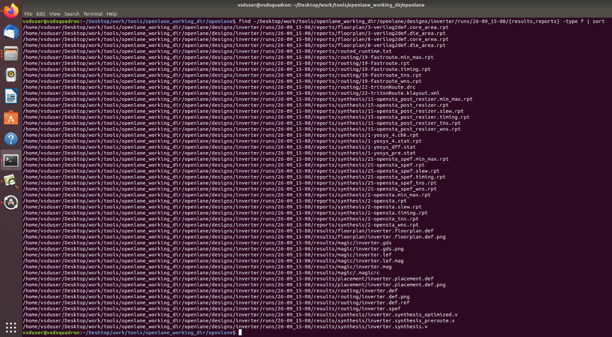
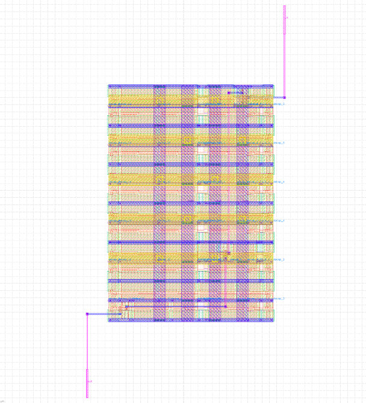

# MODULE 5 – FINAL STAGES OF RTL TO GDS: ROUTING, TRITONROUTE AND OPENSTA

## Routing • Detailed Routing • Design Rule Checking • Static Timing Analysis • Final Verification

---

# 1. INTRODUCTION

After placement and clock tree synthesis, the physical-design flow moves toward one of its final and most important stages: **routing**.

Routing converts the logical connections between cells into actual physical connections using metal layers and vias.

The main purpose of routing is to establish reliable connections between the required source and destination points while obeying:

* Technology design rules
* Routing constraints
* Connectivity requirements
* Metal-layer restrictions
* Wire-width requirements
* Wire-spacing requirements
* Via rules
* Routing directions

The final physical design should contain complete electrical connectivity without unwanted shorts or design-rule violations.

The major concepts covered in this module are:

* Maze routing
* Lee's algorithm
* Routing grids
* Placement blockages
* DRC
* Wire width
* Wire pitch
* Wire spacing
* Signal shorts
* Metal layers
* Vias
* Via width and spacing
* TritonRoute
* Global routing
* Detailed routing
* Route guides
* Access points
* Routing topology
* OpenSTA
* Static Timing Analysis
* Post-route verification
* Final RTL-to-GDS flow

---

# 2. UNDERSTANDING ROUTING

Routing is the process of creating physical connections between different points in a chip.

A routing connection can be considered between:

**Source → Target**

The source may be a cell output or an input/output port, while the target may be another cell input or port.

The router must find a suitable path between these points without violating physical restrictions.

A valid routing solution should:

* Establish complete connectivity
* Avoid obstacles
* Follow routing rules
* Use appropriate metal layers
* Maintain minimum spacing
* Maintain required wire width
* Use valid vias
* Avoid unwanted electrical shorts

Routing therefore acts as the bridge between placed physical cells and the final connected physical layout.

---

# 3. MAZE ROUTING

Maze routing is a path-search technique used to find a connection between a source and a destination.

The routing area can be represented as a grid.

The router explores the available grid positions and searches for a valid path while avoiding blocked areas.

One classical maze-routing method is:

**Lee's Algorithm**

The basic concept is:

1. Represent the routing region using a grid.
2. Begin at the source position.
3. Examine neighboring grid locations.
4. Assign numbers to reachable locations.
5. Continue expanding through available locations.
6. Avoid obstacles and blocked regions.
7. Stop when the target is reached.
8. Trace the path backward from the target to the source.

This approach provides a systematic method for finding a valid routing path.

---

# 4. LEE'S ALGORITHM

Lee's algorithm is a grid-based maze-routing algorithm introduced in 1961.

The algorithm searches the routing grid systematically instead of selecting an arbitrary path.

## Working Procedure

The main steps are:

### Step 1 – Select the Source

The routing process begins from the source point.

### Step 2 – Examine Neighbors

The algorithm checks the adjacent grid positions.

### Step 3 – Assign Grid Numbers

Available neighboring positions are assigned increasing values.

### Step 4 – Continue Expansion

The numbering process continues through all reachable grid locations.

### Step 5 – Avoid Obstacles

Blocked areas and placement restrictions are excluded from the search.

### Step 6 – Reach the Destination

The expansion continues until the target point is reached.

### Step 7 – Trace the Route

After reaching the destination, the algorithm traces backward to obtain the final path.

For example, if a grid position contains value `3`, the next reachable position can be assigned value `4`.

```text
       3
       |
       4
```

This numbering mechanism allows the routing algorithm to identify a path through the routing grid.

---

# 5. ROUTING GRID

A routing grid divides the physical routing region into discrete locations.

The routing algorithm uses these grid locations to search for possible paths.

Important properties of the routing grid include:

* Neighboring locations can be examined.
* Grid positions can be assigned routing values.
* Blocked regions can be excluded.
* Obstacles can be avoided.
* Metal-layer restrictions can be considered.
* The final route must satisfy technology rules.
* Connectivity must be maintained.

The routing grid therefore provides the basic environment in which the router searches for physical connections.

---

# 6. PLACEMENT BLOCKAGES

A placement blockage is an area in which normal placement or routing cannot take place.

When a routing path encounters such a region, the router must search for an alternative path.

For example:

```text
Source
  |
  |
  |        Placement Blockage
  |          ███████████
  |          ███████████
  |                |
  |                |
  +----------------+---------- Target
```

The router must travel around the restricted region instead of passing directly through it.

Therefore, placement blockages are an important factor during route planning.

---

# 7. DESIGN RULE CHECKING

**DRC stands for Design Rule Check.**

DRC verifies whether the physical layout follows the rules defined by the semiconductor technology.

These rules control the physical dimensions and relationships between layout structures.

For routing, important design rules include:

1. Wire width
2. Wire pitch
3. Wire spacing
4. Via width
5. Via spacing
6. Layer restrictions
7. Connectivity-related constraints

A layout that violates these rules cannot be considered physically valid.

---

# 8. WIRE WIDTH

Wire width represents the physical width of a metal interconnect.

Each technology specifies a minimum allowable width for different metal layers.

The wire must satisfy the required minimum dimension.

```text
       Metal Wire
┌────────────────────┐
│                    │
└────────────────────┘
       ← Width →
```

If a wire is narrower than the permitted value, the layout may generate a DRC violation.

Wire dimensions are therefore controlled by technology-specific rules.

---

# 9. WIRE PITCH

Wire pitch refers to the repeated spacing arrangement associated with neighboring wires.

The routing arrangement must maintain the required pitch according to the technology rules.

Proper pitch helps maintain:

* Regular routing
* Required spacing
* Manufacturing reliability
* Design-rule compliance

---

# 10. WIRE SPACING

Wire spacing is the distance between two neighboring wires.

For example:

```text
┌────────────────────┐
│       Wire 1       │
└────────────────────┘

        ↑
        │
      Spacing
        │
        ↓

┌────────────────────┐
│       Wire 2       │
└────────────────────┘
```

The required minimum spacing must be maintained.

If two wires are placed too close together, a DRC violation may occur and unwanted electrical interaction or shorts may result.

---

# 11. SIGNAL SHORT

A signal short occurs when two electrical signals that should remain separate become unintentionally connected.

Possible causes include:

* Insufficient wire spacing
* Incorrect routing
* Improper metal-layer selection
* Incorrect via placement
* Overlapping wires

A short can cause incorrect circuit operation because two independent signals become electrically connected.

## Avoiding a Signal Short

One solution is to move one connection to another metal layer.

For example:

```text
Metal Layer Mn
────────────────────
        |
        | Via
        ↓
────────────────────
Metal Layer Mn+1
```

Using another metal layer provides an additional routing path while keeping the signals separated.

---

# 12. METAL LAYERS

Metal layers provide the physical paths used to carry electrical signals through the chip.

A modern physical design normally contains multiple metal layers.

If a connection cannot be completed conveniently on one layer, the router can change layers using vias.

A simplified representation is:

```text
Metal Layer Mn
────────────────────
        |
        | Via
        ↓
────────────────────
Metal Layer Mn+1
```

Using multiple metal layers provides greater routing flexibility and helps the router avoid congestion and obstacles.

---

# 13. VIA

A **via** creates an electrical connection between different metal layers.

For example:

```text
Metal Layer Mn
────────────────────
        |
       Via
        |
────────────────────
Metal Layer Mn+1
```

Vias allow a signal to move vertically from one metal layer to another.

The physical dimensions and spacing of vias must also follow the technology design rules.

---

# 14. VIA WIDTH

Via width specifies the physical width of the via structure.

The via must satisfy the minimum width requirement specified by the technology.

An incorrectly sized via may result in a DRC violation.

Therefore, routing tools must ensure that every via meets the required dimensional constraints.

---

# 15. VIA SPACING

Via spacing represents the minimum required distance between neighboring vias.

For example:

```text
Via 1                  Via 2
  □                      □
       ← spacing →
```

The specified spacing must be maintained to prevent design-rule violations.

Incorrect via spacing may lead to manufacturing or connectivity problems.

---

# 16. IMPORTANT VIA DESIGN RULES

Two important rules associated with vias are:

### 1. Via Width

The via must have sufficient width according to the technology rules.

### 2. Via Spacing

Neighboring vias must maintain the specified minimum separation.

These rules help prevent unwanted connections and ensure reliable connections between metal layers.

---

# 17. ROUTING COMMANDS

During the OpenLane physical-design flow, the current DEF file can be identified using:

```bash
echo $::env(CURRENT_DEF)
```

The routing-related stages include:

```bash
gen_pdn
```

The command is associated with power-distribution preparation in the physical design.

The routing stage can then be initiated using:

```bash
run_routing
```

These commands are used as part of the physical implementation flow before final verification.

---

# 18. ROUTING USING TRITONROUTE

The routing process using TritonRoute can be divided into two major stages:

```text
Routing
   |
   +----------------------+
   |                      |
Fast / Global Route   Detailed Route
```

The first stage determines the general routing structure.

The second stage generates the actual physical routing.

The two stages are therefore:

1. Fast or Global Routing
2. Detailed Routing

---

# 19. FAST / GLOBAL ROUTING

Fast routing is used to determine an initial routing solution.

The global-routing stage establishes the general topology of the connections and generates routing guides.

The simplified flow is:

```text
Fast Route
    ↓
Global Route
    ↓
Routing Guides
```

At this stage, the router focuses on determining where connections should generally travel rather than creating every final wire segment.

The resulting routing guides are later used by the detailed router.

---

# 20. DETAILED ROUTING

Detailed routing converts routing guides into actual physical wire and via structures.

The process can be represented as:

```text
Routing Guides
      ↓
TritonRoute
      ↓
Detailed Routing
      ↓
Physical Wires + Vias
```

Detailed routing must satisfy:

* Connectivity requirements
* Routing constraints
* Design rules
* Metal-layer restrictions
* Wire-spacing requirements
* Via rules

The result is a physically connected routed design.

---

# 21. TRITONROUTE

**TritonRoute** is the detailed-routing component used in the physical-design flow.

Its purpose is to generate detailed physical routes between the required points while satisfying routing constraints and technology design rules.

## Problem Statement

The routing problem can be summarized as:

> Find a detailed physical connection between required points while satisfying routing constraints and design rules.

---

# 22. TRITONROUTE INPUTS AND OUTPUT

The major inputs to TritonRoute include:

* LEF
* DEF
* Processed route guides

The detailed router uses these inputs to understand:

* Physical dimensions
* Cell locations
* Available routing resources
* Connectivity
* Routing restrictions
* Route-guide information

The output is a detailed routing solution containing physical wires and vias.

The routing solution aims to maintain valid connectivity while controlling routing resources such as wire length and via usage.

---

# 23. TRITONROUTE CONSTRAINTS

TritonRoute must operate within several important constraints.

The major constraints include:

* Route-guide honoring
* Connectivity constraints
* Design rules

The generated route must remain consistent with the routing guides and must produce a valid physical connection.

---

# 24. FUNCTIONS OF TRITONROUTE

TritonRoute performs several routing operations.

Its major functions include:

* Detailed routing
* Following processed route guides
* Maintaining connectivity
* Observing design rules
* Handling routing across metal layers
* Performing parallel routing within layers
* Performing sequential routing between layers

The router works with routing information produced during the earlier global-routing stage.

---

# 25. PROCESSED ROUTE GUIDES

Processed route guides are generated after the fast/global routing stage.

They provide information about where the detailed router should establish physical connections.

The route guides should:

* Have the required width
* Follow the preferred routing direction
* Contain the required routing information
* Satisfy routing constraints
* Maintain connectivity between required regions

These guides provide the framework for the detailed routing process.

---

# 26. INTRA-LAYER AND INTER-LAYER ROUTING

TritonRoute handles routing in two different ways.

## Intra-Layer Parallel Routing

When routing takes place within the same metal layer, multiple routing operations can be handled in parallel.

```text
Intra-Layer
     ↓
Parallel Routing
```

## Inter-Layer Sequential Routing

When routing moves between different metal layers, routing is handled sequentially.

```text
Inter-Layer
     ↓
Sequential Routing
```

This separation helps the routing process manage different metal layers and their associated constraints.

---

# 27. INTER-GUIDE CONNECTIVITY

Inter-guide connectivity describes how two routing guides can be connected.

Two routing guides can be connected in two main ways.

### Same Metal Layer

Two guides can connect when they are located on the same metal layer and their edges touch.

```text
Guide 1 ───────────────┐
                       │
                       └────────────── Guide 2
                              Touching Edges
```

### Neighboring Metal Layers

Guides on neighboring metal layers can also connect when there is a non-zero vertical overlap between them.

```text
Metal Layer M1
────────────────────
        │
        │ Vertical Overlap
        │
────────────────────
Metal Layer M2
```

This connection is generally enabled through appropriate via structures.

---

# 28. ACCESS POINTS

Connectivity between routing regions is handled using **Access Points (APs)**.

An Access Point is a grid location on a metal layer that can be used to establish a routing connection.

Access points may connect:

* Lower-layer routing segments
* Upper-layer routing segments
* Cell pins
* I/O ports

A simplified representation is:

```text
Upper Metal Layer
────────────────────
        |
        | AP
        |
────────────────────
Lower Metal Layer
```

The router selects suitable access points while considering the available routing resources and design constraints.

---

# 29. ACCESS POINT CONNECTIVITY

Access points provide possible locations for establishing valid routing connections.

The router considers several factors when selecting an appropriate access point:

* Connectivity
* Metal layer
* Routing direction
* Via availability
* Design rules

The selected access point must allow the required connection to be established without violating physical constraints.

---

# 30. ROUTING TOPOLOGY

Routing topology describes the structure used to connect all required points.

A valid topology should:

* Connect all required points
* Maintain complete connectivity
* Follow routing guides
* Avoid blockages
* Satisfy design rules
* Use routing resources efficiently
* Avoid unnecessary routing length

The topology determines how the individual access points are interconnected.

---

# 31. ROUTING TOPOLOGY OPTIMIZATION

Routing topology can be optimized using a **Minimum Spanning Tree (MST)** approach.

The objective is to construct a connection structure between access points based on calculated connection costs.

A simplified algorithm is:

```text
1. for all i = 1 to n-1 do

2.     for all j = i+1 to n do

3.         cost_ij ← dist(AP_i, AP_j)

4.     end for

5. end for

6. T ← MST(APs, costs)

7. Return e_ij ∈ T
```

The algorithm first determines the connection cost between pairs of access points.

The minimum spanning tree is then generated from those costs.

---

# 32. COST CALCULATION

The cost of connecting two access points can be based on their distance.

The basic relationship is:

```text
cost_ij ← dist(AP_i, AP_j)
```

where:

* `AP_i` = first access point
* `AP_j` = second access point
* `cost_ij` = cost of connecting the two access points
* `dist()` = distance between the access points

The calculated costs are then used during topology construction.

---

# 33. MINIMUM SPANNING TREE

The routing topology can use a Minimum Spanning Tree to connect the required access points.

The corresponding representation is:

```text
T ← MST(APs, costs)
```

The MST creates a tree structure that connects the required points according to the calculated connection costs.

This provides a systematic method for building a routing topology.

---

# 34. ROUTING TOPOLOGY OPTIMIZATION OBJECTIVES

The routing topology should provide an efficient and valid physical connection.

Important factors include:

* Wire length
* Via count
* Connectivity
* Route guides
* Design rules
* Available routing resources

The goal is to create a usable routing structure without unnecessary physical resources.

---

# 35. DRC AFTER ROUTING

Once routing is complete, the physical design must be checked against the technology design rules.

Important checks include:

* Wire width
* Wire pitch
* Wire spacing
* Via width
* Via spacing
* Signal shorts
* Connectivity

DRC ensures that the generated physical layout remains compatible with the manufacturing rules of the selected technology.

---

# 36. SIGNAL SHORT PREVENTION

Signal shorts can be prevented by following proper routing practices.

Important measures include:

* Maintaining minimum wire spacing
* Following routing guides
* Using additional metal layers when necessary
* Maintaining proper via spacing
* Avoiding overlapping signals
* Following technology-specific design rules

Correct routing must maintain electrical separation between independent signals.

---

# 37. OVERALL ROUTING FLOW

The complete routing process can be summarized as:

```text
Physical Design
      ↓
Current DEF
      ↓
Fast / Global Routing
      ↓
Processed Route Guides
      ↓
TritonRoute
      ↓
Access Points
      ↓
Routing Topology
      ↓
Detailed Routing
      ↓
DRC / Connectivity Checks
```

This flow transforms the placed physical design into a fully routed design.

---

# 38. COMPLETE TRITONROUTE FLOW

A more detailed routing sequence is:

```text
Placed Design
      ↓
Routing Grid
      ↓
Fast / Global Route
      ↓
Routing Guides
      ↓
Processed Route Guides
      ↓
TritonRoute
      ↓
Inter-Guide Connectivity
      ↓
Access Point Selection
      ↓
Routing Topology
      ↓
Detailed Routing
      ↓
DRC
```

Each stage contributes to the creation and verification of the final physical connections.

---

# 39. ROUTING CONSTRAINTS

Routing must satisfy multiple physical constraints.

The important constraints include:

* Route-guide honoring
* Connectivity requirements
* Design rules
* Wire width
* Wire pitch
* Wire spacing
* Via width
* Via spacing
* Preferred routing direction
* Metal-layer restrictions
* Placement blockages
* Routing blockages

A routing solution is considered valid only when these constraints are satisfied.

---

# 40. OPENSTA

**OpenSTA** is used for **Static Timing Analysis**.

After physical implementation and routing, timing analysis is performed to verify whether the design meets its timing requirements.

OpenSTA can analyze:

* Setup timing
* Hold timing
* Clock paths
* Data paths
* Arrival time
* Required time
* Slack

It provides timing information that can be used to identify violations and evaluate the quality of the implemented design.

---

# 41. STATIC TIMING ANALYSIS

Static Timing Analysis, or STA, verifies the timing behavior of the implemented circuit without requiring exhaustive functional simulation.

Instead of testing every possible input sequence, STA evaluates timing paths mathematically.

The analysis determines whether signals can reach their required destinations within the specified timing limits.

STA is particularly useful for analyzing large digital designs where exhaustive simulation would be inefficient.

---

# 42. SETUP TIMING

Setup timing determines whether data reaches the receiving sequential element sufficiently before the active clock edge.

If the data arrives too late, the setup requirement is violated.

Therefore:

**Setup analysis → Checks whether data arrives early enough before the capture edge.**

Setup timing is one of the major checks performed during STA.

---

# 43. HOLD TIMING

Hold timing determines whether data remains stable for the required period after the active clock edge.

If the data changes too early, a hold violation can occur.

Therefore:

**Hold analysis → Checks whether data remains stable long enough after the clock edge.**

Both setup and hold checks are necessary for reliable sequential operation.

---

# 44. SLACK

Slack represents the timing margin available on a path.

The general relationship is:

$$
Slack = Required\ Time - Arrival\ Time
$$

### Positive Slack

Positive slack means the timing requirement is satisfied for that path.

### Negative Slack

Negative slack means that the path does not satisfy its timing requirement.

Therefore, slack is one of the most important values examined in a timing report.

---

# 45. CLOCK PATH ANALYSIS

OpenSTA analyzes the timing behavior of clock paths.

Important clock-related parameters include:

* Clock arrival time
* Clock delay
* Clock skew
* Setup requirement
* Hold requirement

Clock-path behavior directly affects the timing relationship between sequential elements.

---

# 46. DATA PATH ANALYSIS

OpenSTA also evaluates data paths between sequential elements.

The analysis considers:

* Data arrival time
* Required arrival time
* Path delay
* Setup timing
* Hold timing
* Slack

The combination of data-path and clock-path analysis allows STA to determine whether the timing requirements are satisfied.

---

# 47. POST-ROUTE VERIFICATION

After detailed routing is completed, the physical design must undergo final verification.

Important checks include:

* Connectivity
* DRC violations
* Signal shorts
* Wire spacing
* Wire width
* Via spacing
* Via width
* Routing completeness
* Timing violations

These checks confirm that the routed design is physically connected and follows the required technology rules.

---

# 48. FINAL RTL-TO-GDS FLOW

The complete RTL-to-GDS process can be represented as:

```text
RTL
 ↓
Synthesis
 ↓
Floorplanning
 ↓
Placement
 ↓
Clock Tree Synthesis
 ↓
Fast / Global Routing
 ↓
Routing Guides
 ↓
Detailed Routing using TritonRoute
 ↓
DRC / Connectivity Verification
 ↓
Static Timing Analysis using OpenSTA
 ↓
Final Verification
 ↓
GDSII
```

This represents the progression from the original RTL description to the final physical layout database.

---

# 49. FINAL STEPS FROM RTL TO GDS

The final stages of the physical-design flow include:

1. Physical Design
2. Routing
3. Fast / Global Routing
4. Generation of Routing Guides
5. Processing of Routing Guides
6. Detailed Routing using TritonRoute
7. Access Point Handling
8. Routing Topology Optimization
9. DRC Checking
10. Connectivity Verification
11. Post-Route Timing Analysis
12. Static Timing Analysis using OpenSTA
13. Final Verification
14. GDSII Generation

These steps collectively transform the placed design into a verified physical implementation.

---

# 50. IMPORTANT CONCEPTS

## Routing

Creates physical connections between source and destination points.

## Maze Routing

Uses a grid-based search method to determine a valid routing path.

## Lee's Algorithm

A classical maze-routing technique introduced in 1961.

## DRC

Checks whether the physical layout follows the required technology design rules.

## TritonRoute

Performs detailed routing using processed route guides.

## Routing Guide

Provides routing information used to guide detailed routing.

## Access Point

Provides a possible grid location for establishing a routing connection.

## Routing Topology

Defines the structure used to connect the required access points.

## OpenSTA

Performs Static Timing Analysis on the implemented design.

---

# 51. COMPLETE PHYSICAL-DESIGN FLOW

The complete process studied across the physical-design stages can be summarized as:

```text
RTL
  ↓
Synthesis
  ↓
Floorplanning
  ↓
Placement
  ↓
Clock Tree Synthesis
  ↓
Physical Design
  ↓
Routing
  ↓
Maze Routing Concepts
  ↓
Fast / Global Routing
  ↓
Processed Route Guides
  ↓
TritonRoute
  ↓
Inter-Guide Connectivity
  ↓
Access Points
  ↓
Routing Topology
  ↓
Detailed Routing
  ↓
Wire and Via Connections
  ↓
DRC
  ↓
Connectivity Verification
  ↓
OpenSTA
  ↓
Static Timing Analysis
  ↓
Final Verification
  ↓
GDSII
```

---

# 52. CONCLUSION

Routing is one of the final and most important stages of the physical-design process because it converts logical connectivity into actual physical interconnections.

The routing process must establish connections between required source and target points while satisfying technology-specific rules and physical constraints.

The study of **Lee's algorithm** provides an understanding of how grid-based maze routing can be used to search for valid paths.

**TritonRoute** performs detailed routing using processed route guides generated during the global-routing stage. It handles routing constraints, connectivity, access points, metal layers and routing topology.

The physical layout must satisfy important design rules related to:

* Wire width
* Wire pitch
* Wire spacing
* Via width
* Via spacing

After routing, the design undergoes DRC and connectivity verification to identify physical violations and unwanted shorts.

Finally, **OpenSTA** is used to perform Static Timing Analysis. It evaluates setup timing, hold timing, clock paths, data paths, arrival time, required time and slack.

The complete flow ultimately leads toward a verified physical design suitable for **GDSII generation**.

Thus, this module completes the understanding of the final stages of the RTL-to-GDS flow, connecting routing, physical verification and timing analysis into a single implementation process.

---

# 53. FINAL SUMMARY

The complete journey can be viewed as:

```text
RTL Design
    ↓
Synthesis
    ↓
Floorplanning
    ↓
Placement
    ↓
Clock Tree Synthesis
    ↓
Global Routing
    ↓
Route Guides
    ↓
TritonRoute
    ↓
Detailed Routing
    ↓
DRC
    ↓
Connectivity Verification
    ↓
OpenSTA
    ↓
Timing Verification
    ↓
Final Verification
    ↓
GDSII
```

The main outcome is a physically connected, design-rule-compliant and timing-verified implementation that can proceed toward the final GDSII layout.
